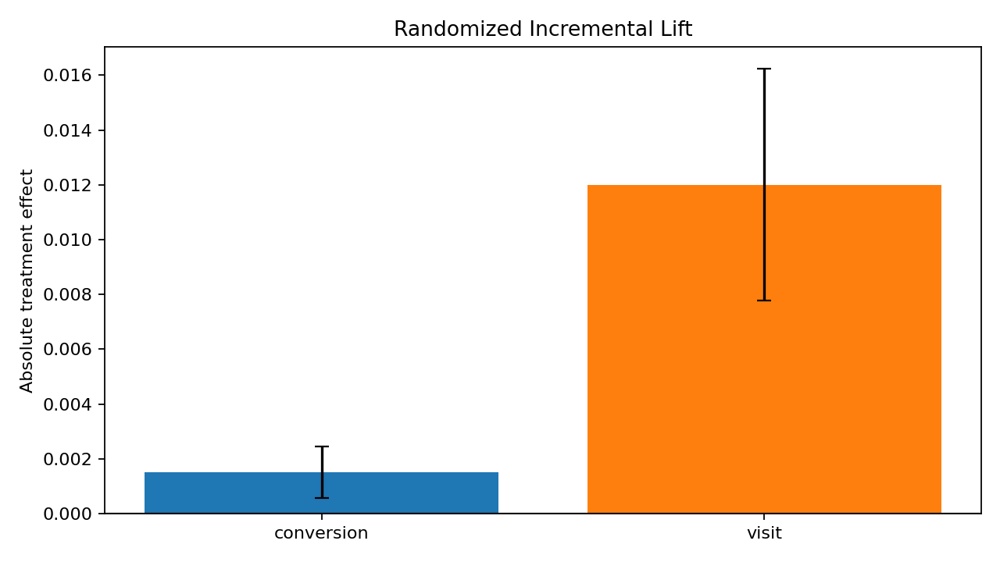
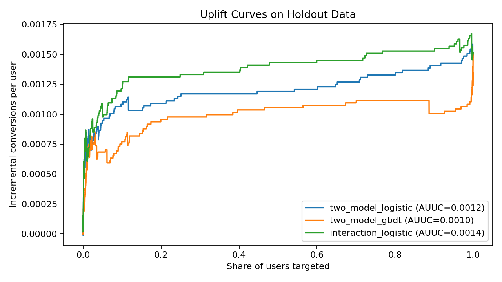
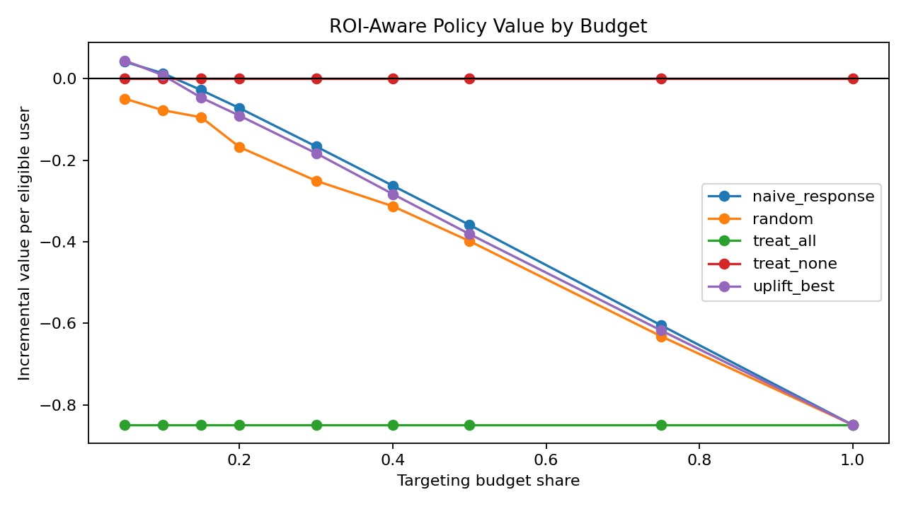

# Promotion Incrementality and Uplift Decision System

This project builds a promotion targeting system around randomized treatment/control data, with an explicit focus on incrementality, heterogeneous treatment effects, and budgeted decision-making.

The leading dataset choice was the **Criteo Uplift Prediction Dataset**, and it ended up being the right anchor for the repo:

- It is a true randomized incrementality benchmark, not just a response prediction table.
- It is large enough to support serious uplift model comparison.
- It supports ATE estimation, uplift modeling, treatment targeting, and offline policy evaluation.
- It does **not** support Difference-in-Differences, Synthetic Control, or SDID because it is not a panel or time-series identification setting.

## Dataset Choice and Tradeoffs

### Selected: Criteo Uplift Prediction Dataset

Why it won:

- Real randomized treatment/control structure.
- Public benchmark used in uplift modeling research.
- Large sample with enough signal to compare targeting policies.
- Directly aligned with the business question: who should receive treatment?

Tradeoffs:

- Features are anonymized, so interpretation is weaker than in a CRM dataset.
- The public file is large, so the pipeline builds a reproducible random sample for laptop-friendly runs.
- There is no temporal panel structure, so panel causal estimators are out of scope on methodological grounds.

### Runner-up: Hillstrom E-Mail Challenge

Why it was not the primary choice:

- It is intuitive and easier to explain.
- It is much smaller and less benchmark-grade for a flagship causal ML repo.
- It is useful as a teaching dataset, but weaker as the main project backbone if the goal is a stronger GitHub portfolio piece.

## What the System Does

The pipeline is organized in the same order a real decisioning team would tackle the problem:

1. Estimate **average treatment effects** from randomized data.
2. Fit **uplift / HTE models** to estimate who benefits from treatment.
3. Rank users by predicted incremental effect.
4. Evaluate **budget-constrained targeting policies** with inverse-propensity policy value estimates.
5. Compare uplift-based targeting against **naive response targeting**, **random targeting**, **treat-all**, and **treat-none** baselines.

## Current Methods

- Randomized experiment analysis with difference-in-means ATE estimates and confidence intervals.
- Uplift modeling with:
  - two-model logistic regression
  - two-model gradient boosting
  - interaction logistic regression
- Model selection using uplift curves, AUUC, and Qini on a validation split.
- ROI-aware policy evaluation using conversion value and treatment cost assumptions under budget limits.

## Repo Layout

```text
configs/
  default.yaml
src/promo_uplift/
  ab_testing.py
  cli.py
  config.py
  data.py
  models.py
  pipeline.py
  plots.py
  policy.py
tests/
reports/
  figures/
  metrics/
  summary.md
```

## Reproducing the Project

```bash
make setup
make test
make run
```

The default run downloads the public Criteo file, builds a random sample of about 300k rows, trains the candidate uplift models, and writes plots and metrics under `reports/`.

## Main Results From the Current Run

Dataset run:

- Random sample size: **299,421**
- Treatment propensity in the test split: **0.8481**
- Best uplift model by validation AUUC: **two_model_logistic**

Randomized experiment results on the holdout set:

- **Conversion ATE:** `+0.001512` absolute lift, 95% CI `[0.000575, 0.002450]`, `p=0.00157`
- **Visit ATE:** `+0.012007` absolute lift, 95% CI `[0.007783, 0.016231]`, `p=2.52e-08`

Model ranking on validation AUUC:

- `two_model_logistic`: `0.001250`
- `interaction_logistic`: `0.001002`
- `two_model_gbdt`: `0.000990`

Policy takeaways with `conversion_value=100` and `treatment_cost=1`:

- Uplift targeting beats random and treat-all at tight budgets.
- At a **5% budget**, uplift targeting produces positive incremental value per eligible user (`0.0445`), slightly ahead of naive response targeting (`0.0414`).
- As the budget expands, the marginal population becomes less incremental and policy value turns negative.
- Treating everyone is strongly dominated under the current cost/value assumptions.

## Visuals

### Randomized Lift



### Uplift Curves



### Budgeted Policy Value



## Notes on Scope

- This is a **causal decision system**, not a plain conversion predictor.
- The `exposure` column is intentionally not used as a modeling target because it is post-treatment.
- DiD, Synthetic Control, and SDID are intentionally excluded because the selected data does not support panel or temporal identification.

## Tests

```bash
make test
```

The tests cover core causal effect and policy-evaluation utilities so the project is not just a report-generating script.
